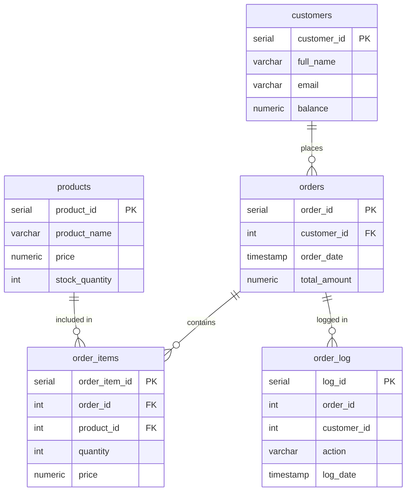

# Practice Assignment 3 - order management database

Database system for managing orders in an online store. Implements functions, procedures, triggers, logging and query analysis.

## Database Structure

| Table | Description |
|-------|-------------|
| `customers` | Customer data: id, full_name, email, balance |
| `products` | Product data: id, name, price, stock quantity |
| `orders` | Orders linked to customers |
| `order_items` | Individual items inside each order |
| `order_log` | Audit log for new order events |

## Main Tasks:

### Task 1 - Function: calculate order total

Calculates the total cost of an order. Sums (price * quantity) for all items in order_items for the given order. Returns - if the order is empty.

### Task 2 - Procedure: create new order

Creates a new order for a customer. Only inserts if the customer exists - invalid customer_id is ignored.

### Task 3 - Procedure: add product to order

Adds a product to an existing order. Takes the current price from products and reduces stock. Skips the insert if quantity is zero or if there is not enough stock.

### Task 4 - Trigger: update order total

Triggers after any insert, update or delete on order_items. Automatically recalculates and updates orders.total_amount using the function from task 1.

### Task 5 - Trigger: order audit log

Triggers after a new order is inserted. Writes a log entry to order_log with the order_id, customer_id, action 'order_created' and timestamp.

### Task 6 - Testing

- Inserted test customers and products
- Called create_order() with a valid and an invalid customer_id
- Called add_product_to_order() with valid, zero, and out-of-stock quantities
- Checked that order_items, orders.total_amount, products.stock_quantity, and order_log all updated correctly

## Comments about queries:
Comments and explanation in sql file named "PracticeAssignment3"

### Note:
README file was polished (structure and typo fixing) by AI tool
