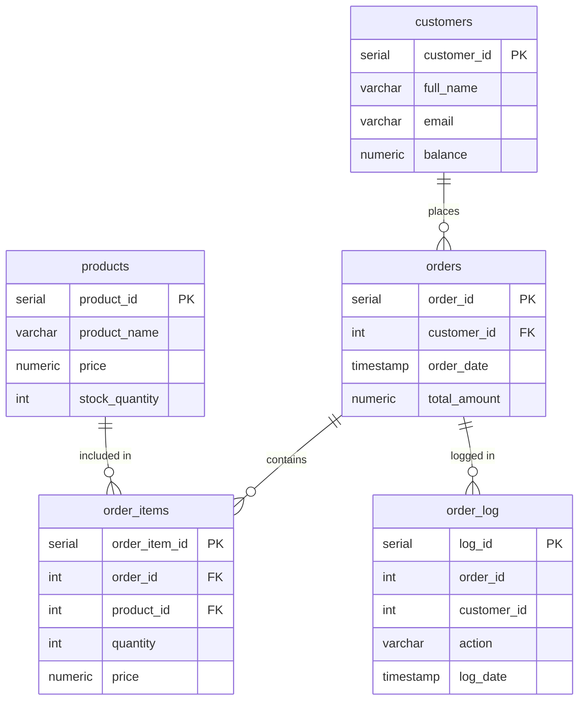

# Practice Assignment 3 - order management database

Database system for managing orders in an online store. Implements functions, procedures, triggers, logging and query analysis.

## Database Structure

## Comments about queries:
Comments and explanation in sql file named "PracticeAssignment3"
