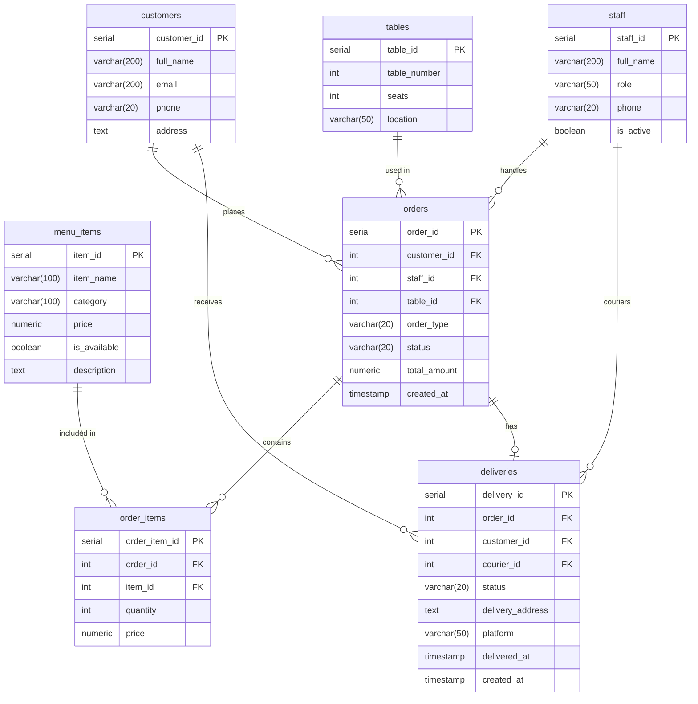

# Practice Assignment 4 

## Database Structure

```mermaid
erDiagram
    customers {
        serial customer_id PK
        varchar(200) full_name
        varchar(200) email
        varchar(20) phone
        text address
    }

    staff {
        serial staff_id PK
        varchar(200) full_name
        varchar(50) role
        varchar(20) phone
        boolean is_active
    }

    tables {
        serial table_id PK
        int table_number
        int seats
        varchar(50) location
    }

    menu_items {
        serial item_id PK
        varchar(100) item_name
        varchar(100) category
        numeric price
        boolean is_available
        text description
    }

    orders {
        serial order_id PK
        int customer_id FK
        int staff_id FK
        int table_id FK
        varchar(20) order_type
        varchar(20) status
        numeric total_amount
        timestamp created_at
    }

    order_items {
        serial order_item_id PK
        int order_id FK
        int item_id FK
        int quantity
        numeric price
    }

    deliveries {
        serial delivery_id PK
        int order_id FK
        int customer_id FK
        int courier_id FK
        varchar(20) status
        text delivery_address
        varchar(50) platform
        timestamp delivered_at
        timestamp created_at
    }

    customers ||--o{ orders : "places"
    staff ||--o{ orders : "handles"
    tables ||--o{ orders : "used in"
    orders ||--o{ order_items : "contains"
    menu_items ||--o{ order_items : "included in"
    orders ||--o| deliveries : "has"
    customers ||--o{ deliveries : "receives"
    staff ||--o{ deliveries : "couriers"
```

## Comments about queries:

### Note:

