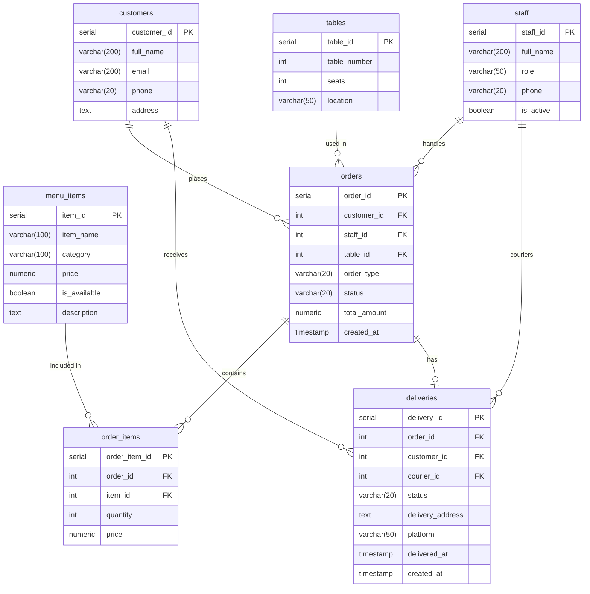

# Practice Assignment 4 

Here you can find design and implementation of database for restaurant. The database supports inside-restaurant, takeaway and delivery orders with full order tracking.

## Database Structure

### Tables

| Table | Description |
|---|---|
| `customers` | customers of restaurant with contact info |
| `staff` | employees: waiters, cooks, couriers, admins |
| `tables` | physical restaurant tables (indoor/outdoor/bar) |
| `menu_items` | food and drink items with pricing |
| `orders` | all orders (delivery, takeaway, inside) |
| `order_items` | individual items per order |
| `deliveries` | delivery tracking with courier and platform info |

### Relationships

- `customers` → `orders` (1:many)
- `staff` → `orders` (1:many)
- `tables` → `orders` (1:many)
- `orders` → `order_items` (1:many)
- `menu_items` → `order_items` (1:many)
- `orders` → `deliveries` (1:1)
- `customers` → `deliveries` (1:many)
- `staff (courier)` → `deliveries` (1:many)

### ERD

## Files

| File | Description |
|---|---|
| `TablesPracticeAssignment4.sql` | creates all tables, constraints, comments and indexes |
| `PracticeAssignment4View.sql` | creates the `delivery_details` view |
| `PracticeAssignment4Users.sql` | creates 3 database users with different privileges |
| `PracticeAssignment4Trigger.sql` | creates the trigger and trigger function |
| `main.py` | Python script that inserts rows of test data |

## View

delivery_details - a view that shows all delivery orders in one place. It joins data from deliveries, customers, staff (courier) and orders tables, so you can easily see who ordered, who delivers, where and on which platform - without writing a complex query every time

## Users and Privileges

Three database users are created with different levels of access:

| User | Password | Access |
|---|---|---|
| `menu_reader` | `123456Aa@` | can only read `menu_items` - for apps or screens that display the menu |
| `waiter` | `654321Ww@` | can read customers, tables, menu and staff; can create and update orders; can view deliveries |
| `restaurant_admin` | `654321Admin!@` | full access to all tables, views and sequences |

## Trigger

create_delivery - a trigger on the orders table that fires automatically after a new order is inserted.
If the order type is 'delivery', it creates a corresponding record in the deliveries table with:
- status 'waiting' (no courier assigned yet)
- the customer's address (or 'address not provided' if missing)
- platform set to 'own delivery' by default

This means you never need to manually insert into deliveries for delivery orders - it happens automatically

## Indexes

Indexes created for performance optimization:

| Index | Table | Column |
|---|---|---|
| `index_orders_created_at` | orders | created_at |
| `index_orders_customer_id` | orders | customer_id |
| `index_orders_status` | orders | status |
| `index_order_items_order_id` | order_items | order_id |
| `index_order_items_item_id` | order_items | item_id |
| `index_deliveries_order_id` | deliveries | order_id |

## Comments about queries:
Explanation of queries (view, trigger, users, tables) is in sql files.

### Note:
The readme file was polished by the use of AI (table constructions(that are inside readme file), typo fixing). Also, main.py file for data insertion in tables was made by AI.

