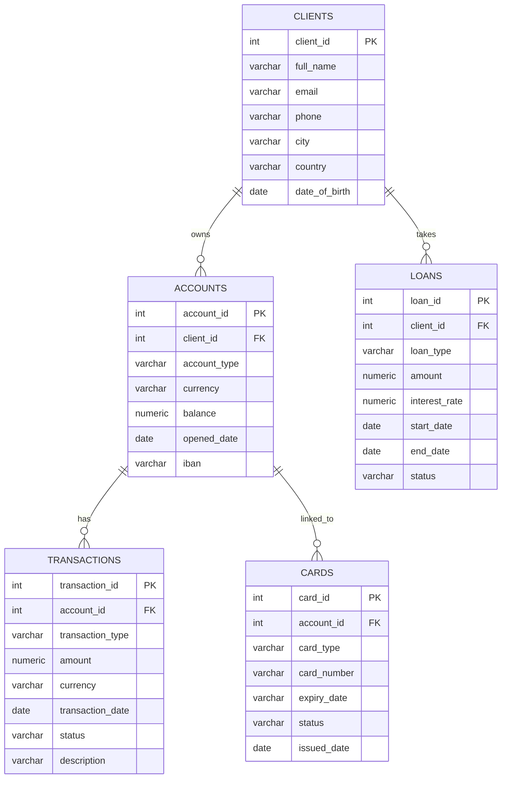

## Here you can find realisation of the first Practice Assignment for course "Introduction to Databases"

## Overview

This project contains a banking database with 5 interconnected tables and complex SQL queries demonstrating joins, aggregations, cte and union all operations

## Database Schema

## Tables Description

| Table | Rows | Description |
|---|---|---|
| `clients` | 10000 | Bank clients with personal info |
| `accounts` | 10000 | Bank accounts linked to clients |
| `transactions` | 10000 | Transactions per account |
| `loans` | 10000 | Loans taken by clients |
| `cards` | 10000 | Cards linked to accounts |

## Note
Data was generated by AI tool, schema and description above were also generated by AI tool.
